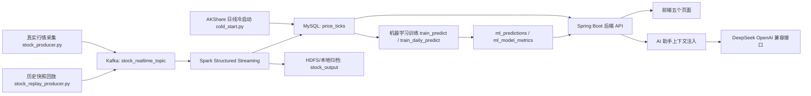

# Quant Stream 股票实时流分析平台功能说明（AI 阅读版）

> 本文档面向 AI 助手、答辩讲解和后续维护人员。目标是让阅读者快速理解：项目解决什么问题、有哪些模块、数据如何流转、核心文件在哪里、如何运行、如何判断系统是否正常。

## 1. 项目一句话定位

Quant Stream 是一个面向课程实践/毕业设计展示的股票实时流分析平台。系统从 A 股、港股、美股行情源采集或回放股票数据，经 Kafka 和 Spark Structured Streaming 做实时清洗、统计、告警识别和归档，落库到 MySQL，再由 Spring Boot 后端提供 API，前端用 ECharts 展示预测大屏、风险告警、模型分析、市场图表、系统状态，并通过 AI 助手对系统数据进行自然语言解读。

## 2. AI 快速上下文

```yaml
project_name: Quant Stream 股票实时流分析平台
main_goal: 展示股票实时流处理、异常告警、模型预测、可视化大屏和 AI 数据解读
runtime_style: Windows 本地课程演示为主，也可接真实行情源
main_chain:
  - Python 采集或历史回放生成股票行情 JSON
  - Kafka topic stock_realtime_topic 接收行情流
  - Spark Structured Streaming 消费 Kafka 并写 MySQL/HDFS
  - Spring Boot 查询 MySQL 并提供 REST API
  - HTML/CSS/JavaScript 前端展示仪表盘
  - AI 助手读取后端上下文并调用 DeepSeek 兼容接口
important_tables:
  - price_ticks: 原始行情明细
  - alert_events: 异常告警事件
  - alert_actions: 告警处理状态
  - metric_snapshots: 实时统计快照
  - symbol_stats: 个股聚合统计
  - sector_stats: 行业统计
  - category_stats: 股票池分类统计
  - ml_predictions: 当前模型预测结果
  - ml_prediction_history: 预测历史
  - ml_model_metrics: 模型验证指标
important_ports:
  frontend: 5500
  backend: 8080
  mysql: 3306
  kafka: 9092
  zookeeper: 2181
  hdfs: 9000
```

## 3. 当前状态与已知问题

本节记录当前项目的真实状态，供后续 AI 继续排查或修改时优先参考。

### 3.1 当前已经具备的能力

- 前端页面、Java 后端、Python 训练脚本、MySQL 表结构已经形成完整工程。
- 日线冷启动数据已经导入 MySQL，`akshare_cold_start` 当前有约 1.5 万条历史日线样本，覆盖 16 只 A 股。
- 日线模型训练可以成功运行，最近一次训练版本为 `daily-20260505163008`。
- 当前训练可以成功产出 Random Forest、LightGBM、PyTorch LSTM 三类模型，并把预测结果写入 `ml_predictions`，把验证指标写入 `ml_model_metrics`。
- 前端已经改为优先展示风控更有意义的模型指标：`balanced_direction_accuracy`、`direction_macro_f1`、`majority_baseline_accuracy`，而不是只看原始 `direction_accuracy`。

### 3.2 当前主要问题

#### 问题 1：实时流链路启动不稳定

现象：

- ZooKeeper 日志中出现 `Unable to access datadir`。
- Kafka 启动时连接 ZooKeeper 超时。
- Producer 报 `NoBrokersAvailable`。
- Spark 报 Ivy 缓存文件写入被拒绝，例如 `.ivy2/cache/resolved-...xml` 访问失败。

影响：

- 实时采集、Kafka、Spark 没有稳定形成持续数据流。
- 机器学习训练主要依赖 `akshare_cold_start` 日线数据，而不是实时流入的分钟行情。
- 前端“实时流状态”和“近 1 分钟事件数”可能显示离线或停止。

当前已处理：

- `tools/start_demo.ps1` 已把全局 `$ErrorActionPreference` 调整为 `Continue`，并对 `hdfs dfsadmin -safemode leave`、HDFS 目录创建、Kafka topic 创建加了容错处理。
- `tools/start_demo.ps1` 已新增 `Wait-KafkaReady()`，在提交 Spark 前轮询 `kafka-broker-api-versions.bat`，避免 Kafka 端口刚监听但 broker API 尚未就绪时触发 `NoBrokersAvailable`。
- `python/spark/stock_streaming_job.py` 已把 HDFS parquet 写入包进 `try/except`。HDFS 不可用时只记录 warning，MySQL 写入继续执行，前端仍可看到实时行情和统计。

优先排查：

```text
tools/start_demo.ps1
.runtime/stock_stream_runtime/zookeeper.stderr.log
.runtime/stock_stream_runtime/kafka.stdout.log
.runtime/stock_stream_runtime/spark-streaming.stderr.log
.runtime/stock_stream_runtime/stock-producer.stderr.log
```

#### 问题 2：机器学习方向准确率看起来偏低

现象：

- 验证集标签不是简单涨/跌，而是 `DOWN / UP / WATCH` 三分类。
- 当前验证集中 `WATCH` 接近一半，多数类基线约 47% 到 49%。
- 原始 `direction_accuracy` 可能低于多数类基线。

原因：

- 股票短期方向预测本身噪声很大。
- 项目保留 `WATCH`，符合风控场景中“无明显信号时观望”的逻辑。
- 代码使用类别平衡权重，模型会更积极识别 `UP` 和 `DOWN`，这会牺牲原始准确率。
- 实时分钟数据里重复价格很多，经过折叠后，美股部分股票有效样本很少。

当前处理方式：

- 不为了提高表面准确率而删除 `WATCH`。
- 保留三分类，因为项目主题是“风险预警与辅助决策”，不是只做涨跌竞猜。
- 模型选择已改为按风控方向质量评分，而不是只按收益率误差或原始准确率。

相关代码：

```text
python/ml/stock_ml.py -> direction_quality_score()
python/ml/stock_ml.py -> select_best_model()
python/ml/stock_ml.py -> predict_latest_ensemble()
frontend/index.html -> modelQualityMetric()
frontend/dash-pages.js -> renderModels()
frontend/shared-ui.js -> metricLabel() / modelBenchmark()
```

#### 问题 3：配置与安全仍偏本地演示

当前配置中存在本地演示用的明文 MySQL 账号密码，例如 `root/root`。后端 CORS 当前允许前端跨域访问 API。该项目用于本地课程演示时问题不大，但如果部署到局域网或公网，需要补充：

- `.env` 加入 `.gitignore`。
- MySQL 使用低权限账号。
- 后端 POST 接口增加简单 token 或登录认证。
- CORS 限制到实际前端地址。

### 3.3 后续 AI 修改优先级

如果后续 AI 接手项目，建议按以下优先级处理：

1. 先修 `tools/start_demo.ps1` 相关的 ZooKeeper/Kafka/Spark 启动问题，让实时流真正跑起来。
2. 继续使用 `train_daily_predict.py` 作为答辩主模型训练入口，保证模型展示稳定。
3. 不要把 `WATCH` 强行删掉；如要做二分类，应新增实验脚本，不要替换当前风控主逻辑。
4. 前端模型页继续强调“平衡准确率、宏平均 F1、多数类基线”，避免只展示原始准确率。
5. 若模型指标仍弱，优先增加高质量历史数据，而不是盲目调参。

## 4. 总体架构



## 5. 目录和职责

| 路径 | 职责 |
|---|---|
| `python/common/` | 公共配置、股票代码规范化、涨跌幅计算、行情合法性校验 |
| `python/producer/` | 股票池加载、真实行情采集、历史行情回放、不同网站行情源适配 |
| `python/spark/stock_streaming_job.py` | Kafka 消费、Spark 流处理、异常告警识别、MySQL/HDFS 写入 |
| `python/ml/` | 冷启动数据导入、分钟/日线模型训练、模型漂移检查、预测结果写库 |
| `python/sql/init.sql` | MySQL 表结构初始化 |
| `java-backend/` | Spring Boot 后端，提供 dashboard、股票、告警、模型、AI 接口 |
| `frontend/` | 首页大屏和四个子页面，使用原生 HTML/CSS/JS + ECharts |
| `tools/` | 一键启动、停止、健康检查脚本 |
| `docs/` | 项目说明、增强功能说明和本文档 |

## 6. 数据采集模块

### 5.1 股票池

股票池文件：

```text
python/data/stock_symbols.json
```

作用：

- 定义系统监控哪些股票。
- 保存股票代码、公司名、市场、行业、分类等展示字段。
- 真实采集和历史回放都会以股票池作为元数据来源。

### 5.2 真实行情采集

入口文件：

```text
python/producer/stock_producer.py
```

核心逻辑：

- 加载股票池。
- 并发请求多个行情源。
- 对每只股票生成统一 JSON 行情事件。
- 校验合法后写入 Kafka。

支持的数据源逻辑在：

```text
python/producer/stock_sources.py
```

主要设计点：

- 支持多源 fallback。
- A 股、港股、美股使用不同来源时仍转换为统一字段。
- Kafka message key 使用股票代码，value 使用 UTF-8 JSON。

### 5.3 历史快照回放

入口文件：

```text
python/producer/stock_replay_producer.py
```

用途：

- 休市、网络不稳定、答辩演示时使用。
- 从 `python/data/crawled/stock_quotes_*.json` 读取真实采集快照。
- 给价格、成交量加入小幅扰动，模拟实时流动效果。
- 按固定间隔写入 Kafka。

常用命令：

```powershell
D:\anaconda3\envs\MachineLearn\python.exe -m python.producer.stock_replay_producer --interval 3 --volatility 1.2
```

## 7. Kafka 与 Spark 流处理

### 6.1 Kafka

项目默认 topic：

```text
stock_realtime_topic
```

Kafka 在项目中的作用：

- 解耦行情生产者和 Spark 消费者。
- 允许真实采集、历史回放使用同一条流处理链路。
- 支持课程答辩时说明“实时流”入口。

### 6.2 Spark Structured Streaming

入口文件：

```text
python/spark/stock_streaming_job.py
```

核心流程：

1. 从 Kafka 读取 value 字段。
2. 按固定 schema 解析 JSON。
3. 过滤非法行情，例如价格小于等于 0、成交量小于等于 0、涨跌幅明显异常。
4. 对每个微批执行 `foreachBatch`。
5. 写入 HDFS/本地归档。
6. 计算分钟级市场统计、个股统计、行业统计、分类统计。
7. 根据价格波动和成交量放大识别告警。
8. 写入 MySQL。

Spark 输出表：

- `price_ticks`
- `metric_snapshots`
- `symbol_stats`
- `sector_stats`
- `category_stats`
- `alert_events`

告警识别规则：

- 价格波动告警：`abs(change_pct)` 超过固定阈值或历史动态阈值。
- 成交量告警：当前成交量超过市场类型对应的最低阈值或历史均值倍数。
- 告警等级：`MEDIUM` 或 `HIGH`。

## 8. MySQL 数据模型

初始化文件：

```text
python/sql/init.sql
```

核心表说明：

| 表名 | 作用 |
|---|---|
| `price_ticks` | 每条行情明细，是大屏、趋势图、模型训练的基础数据 |
| `metric_snapshots` | 按分钟窗口保存市场统计快照 |
| `symbol_stats` | 个股维度聚合统计 |
| `sector_stats` | 行业维度统计 |
| `category_stats` | 股票池分类统计 |
| `alert_events` | Spark 识别出的异常告警 |
| `alert_actions` | 告警处理状态，如 OPEN、ACKED、IGNORED、RESOLVED |
| `ml_predictions` | 当前模型预测结果，前端展示 AI 预测信号 |
| `ml_prediction_history` | 预测历史，用于漂移检查和回溯 |
| `ml_model_metrics` | 模型验证指标，如方向准确率、平衡准确率、F1、MAE |

字段关系：

- `symbol` 是贯穿行情、告警、预测、排行的主关联字段。
- `event_time` 表示行情事件时间。
- `created_at` 表示记录写入数据库的时间。
- 前端实时状态主要看 `created_at` 是否接近当前时间。

## 9. 机器学习模块

目录：

```text
python/ml/
```

主要文件：

| 文件 | 作用 |
|---|---|
| `cold_start.py` | 使用 AKShare 导入 A 股日线历史数据到 `price_ticks` |
| `cold_start_import.py` | 已废弃的兼容入口，实际委托到 `cold_start.py`，避免两套 event_id 产生重复训练样本 |
| `stock_ml.py` | 模型训练、特征工程、预测、指标计算、写库的核心实现 |
| `train_predict.py` | 基于 `price_ticks` 训练分钟/短期模型 |
| `train_daily_predict.py` | 基于 `akshare_cold_start` 日线数据训练日线预测模型 |
| `model_drift.py` | 检查模型预测历史是否发生漂移 |

当前支持模型：

- `random_forest`
- `lightgbm`
- `lstm`
- `ensemble`

模型输出：

- `ml_predictions.predicted_signal`: `UP`、`DOWN`、`WATCH`
- `ml_predictions.confidence`: 展示置信度，范围 0 到 1
- `ml_predictions.predicted_next_price`: 预测下一时刻价格
- `ml_model_metrics`: 验证指标

当前模型口径：

- 项目主题是“股票实时风控与风险预警”，所以方向模型保留 `UP / DOWN / WATCH` 三分类。
- `WATCH` 表示模型认为当前没有足够明确的上涨或下跌信号，适合作为风险控制中的观望状态。
- 不建议为了提高表面准确率直接删除 `WATCH`。如果要做涨跌二分类，应新增实验分支，不要替换主流程。
- `select_best_model()` 当前按 `direction_quality_score()` 选择运营模型。
- `direction_quality_score()` 综合考虑 `balanced_direction_accuracy`、`direction_macro_f1`、`direction_lift_over_baseline`、`direction_accuracy` 和 `return_mae`。
- `predict_latest_ensemble()` 当前也使用 `direction_quality_score()` 作为 LightGBM 与 LSTM 的融合权重。
- 前端展示时优先显示 `balanced_direction_accuracy` 和 `direction_macro_f1`，因为它们比原始准确率更能说明模型是否识别了上涨、下跌和观望三类状态。

日线模型推荐流程：

```powershell
cd E:\作业\ww\Comprehensive_practice
python -m python.ml.cold_start --days 900
python -m python.ml.train_daily_predict
```

短期模型训练流程：

```powershell
cd E:\作业\ww\Comprehensive_practice
python -m python.ml.train_predict
```

注意：

- 如果实时数据重复、停盘数据过多，分钟模型会出现直线、预测无意义、指标虚高等问题。
- 日线预测应优先使用 `source='akshare_cold_start'` 的历史日线数据。
- 模型指标不能只看 `direction_accuracy`，还要看 `balanced_direction_accuracy`、`direction_macro_f1`、`majority_baseline_accuracy` 和样本分布。

## 10. Java 后端模块

目录：

```text
java-backend/src/main/java/com/recruitment/backend/
```

核心类：

| 文件 | 职责 |
|---|---|
| `RecruitmentBackendApplication.java` | Spring Boot 启动类 |
| `config/CorsConfig.java` | 允许前端跨域访问后端 API |
| `controller/DashboardController.java` | 提供行情、告警、模型、历史数据 API |
| `controller/AiChatController.java` | 提供 AI 对话、流式输出、健康检查接口 |
| `service/DashboardService.java` | 查询 MySQL，组装前端所需 dashboard 数据 |
| `service/AiChatService.java` | 构造 AI 上下文、调用 DeepSeek、无 Key 时本地兜底 |

### 9.1 Dashboard API

基础地址：

```text
http://127.0.0.1:8080/api
```

主要接口：

| 接口 | 作用 |
|---|---|
| `GET /api/dashboard` | 首页大屏所需的聚合数据 |
| `GET /api/health` | 数据库、流状态、HDFS/存储状态 |
| `GET /api/stocks?keyword=&limit=20` | 搜索股票 |
| `GET /api/stocks/{symbol}` | 获取单只股票详情 |
| `GET /api/stocks/{symbol}/trend?minutes=30` | 获取单只股票趋势 |
| `GET /api/stocks/ranking?type=optimal` | 获取优选或风险排行 |
| `GET /api/alerts` | 查询告警列表 |
| `POST /api/alerts/{id}/status` | 更新告警处理状态 |
| `GET /api/ml/models` | 获取模型指标 |
| `GET /api/history` | 查询历史行情 |
| `GET /api/history/export` | 导出 CSV |

### 9.2 AI API

基础地址：

```text
http://127.0.0.1:8080/api/ai
```

接口：

| 接口 | 作用 |
|---|---|
| `POST /api/ai/chat` | AI 对话；支持 JSON 和 `stream:true` 流式返回 |
| `POST /api/ai/clear` | 清理前端会话的兼容接口 |
| `GET /api/ai/health` | 查看 AI 服务状态和模型名 |

AI 请求格式：

```json
{
  "messages": [
    {"role": "user", "content": "当前风险最高的是哪只股票？原因是什么？"}
  ],
  "question": "当前风险最高的是哪只股票？原因是什么？",
  "mode": "chat",
  "symbol": "",
  "stream": true
}
```

AI 设计原则：

- AI 不直接查数据库，后端先从 `DashboardService` 拉取结构化上下文。
- 后端把行情、告警、模型预测、排行、外部资讯注入 system prompt。
- AI 根据用户意图分为：数据解读、报告生成、联网状态、外部资讯、普通聊天。
- 未配置 `DEEPSEEK_API_KEY` 时返回本地规则兜底，不应让前端直接报错。

当前配置文件：

```text
java-backend/src/main/resources/application.yml
```

AI 配置项：

```yaml
app:
  ai:
    model: deepseekv4
    api-url: https://api.deepseek.com/chat/completions
    web-enabled: true
```

## 11. 前端页面

目录：

```text
frontend/
```

页面：

| 页面 | 作用 |
|---|---|
| `index.html` | 预测大屏：首页，展示 KPI、主股票趋势、行业热力、预测信号、实时流、告警、模型验证、系统状态 |
| `alerts.html` | 风险告警中心：筛选、查看、处理告警 |
| `models.html` | 模型分析中心：模型指标、信号分布、优选/高风险股票 |
| `market.html` | 市场图表中心：市场涨跌、行业异常、最新行情 |
| `system.html` | 系统状态中心：MySQL、实时流、数据源、HDFS/Checkpoint 状态 |

公共资源：

| 文件 | 作用 |
|---|---|
| `dashboard-home.js` | 首页大屏业务逻辑 |
| `shared-ui.js` | 前端 API、指标口径、告警原因和 Markdown 安全渲染等共用逻辑 |
| `dash-pages.css` | 子页面统一浅色样式 |
| `dash-pages.js` | 子页面公共渲染逻辑和 AI 助手 |

前端刷新机制：

- 首页定时调用 `/api/dashboard`。
- 股票趋势图调用 `/api/stocks/{symbol}/trend`。
- AI 助手调用 `/api/ai/chat`。
- 页面通过 `stream_status` 判断当前是 `LIVE`、`REPLAY`、`OFFLINE`，通过 `stream_state` 判断 `FLOWING`、`DELAYED`、`STOPPED`。

## 12. 一键运行

推荐演示启动：

```powershell
cd E:\作业\ww\Comprehensive_practice
powershell -ExecutionPolicy Bypass -File .\tools\start_demo.ps1
```

使用真实采集：

```powershell
powershell -ExecutionPolicy Bypass -File .\tools\start_demo.ps1 -UseRealCrawler
```

停止：

```powershell
powershell -ExecutionPolicy Bypass -File .\tools\stop_demo.ps1
```

健康检查：

```powershell
powershell -ExecutionPolicy Bypass -File .\tools\health_check.ps1
```

前端地址：

```text
http://127.0.0.1:5500/index.html
```

## 13. 手动运行顺序

1. 初始化 MySQL：

```sql
CREATE DATABASE IF NOT EXISTS stock_stream DEFAULT CHARSET utf8mb4;
USE stock_stream;
SOURCE E:/作业/ww/Comprehensive_practice/python/sql/init.sql;
```

2. 启动 ZooKeeper、Kafka，并创建 topic：

```powershell
E:\software\kafka_2.13-3.7.1\bin\windows\kafka-topics.bat --bootstrap-server 127.0.0.1:9092 --create --if-not-exists --topic stock_realtime_topic --partitions 1 --replication-factor 1
```

3. 启动 Spark：

```powershell
E:\software\spark-3.5.2-bin-hadoop3\bin\spark-submit.cmd --packages org.apache.spark:spark-sql-kafka-0-10_2.12:3.5.2,mysql:mysql-connector-java:8.0.33 python\spark\stock_streaming_job.py
```

4. 启动数据生产者：

```powershell
D:\anaconda3\envs\MachineLearn\python.exe -m python.producer.stock_replay_producer --interval 3 --volatility 1.2
```

5. 启动后端：

```powershell
cd E:\作业\ww\Comprehensive_practice\java-backend
mvn -q -DskipTests package
java -jar target\stock-risk-backend-0.0.1-SNAPSHOT.jar
```

6. 启动前端：

```powershell
cd E:\作业\ww\Comprehensive_practice
D:\anaconda3\envs\MachineLearn\python.exe -m http.server 5500 --directory frontend
```

## 14. 答辩展示建议

建议演示顺序：

1. 打开首页，说明整体链路：采集、Kafka、Spark、MySQL、后端、前端。
2. 展示实时流状态和近 1 分钟事件数，证明数据在流动。
3. 切换股票，展示趋势图和短期预测。
4. 打开风险告警，说明价格波动和成交量异常如何识别。
5. 打开模型分析，说明模型不是简单展示数据，而是训练后写入预测结果。
6. 打开系统状态，说明 MySQL、数据源、HDFS/Checkpoint 的健康检查。
7. 打开 AI 助手，提问：
   - “当前风险最高的是哪只股票？原因是什么？”
   - “请生成 600519 贵州茅台 的完整股票分析报告。”
   - “最近市场整体情绪怎么样？”

## 15. 常见问题与判断方法

### 14.1 前端显示离线

可能原因：

- Kafka/Spark/Producer 没启动。
- `price_ticks.created_at` 太久没有新数据。
- 后端连接的 MySQL 不是当前写入的库。

检查：

```powershell
powershell -ExecutionPolicy Bypass -File .\tools\health_check.ps1
```

### 14.2 图表是直线

可能原因：

- 使用的是停盘时的真实行情，价格不变。
- 回放脚本使用了 `--no-jitter`。
- 数据库里存在大量重复快照。
- 某些股票短时间内确实没有价格变化。

解决思路：

- 演示时使用 `stock_replay_producer.py --volatility 1.2`。
- 对模型训练优先使用日线冷启动数据，不要用大量重复分钟快照。

### 14.3 模型指标异常高

可能原因：

- 样本分布单一。
- 标签大量集中在 `WATCH` 或同一方向。
- 重复价格数据过多。
- 训练集和验证集时间切分不合理。

判断指标：

- `direction_accuracy` 高不一定好。
- 如果 `majority_baseline_accuracy` 也很高，说明多数类基线已经很强。
- 更应看 `balanced_direction_accuracy` 和 `direction_macro_f1`。

### 14.4 AI 返回答非所问

可能原因：

- 前端没有传 `messages` 或 `question`。
- 后端没有识别到股票代码或公司名。
- `DashboardService` 查不到该股票数据。
- 未配置 `DEEPSEEK_API_KEY` 时走本地规则兜底，回答会更模板化。

检查：

```powershell
Invoke-WebRequest -Uri http://127.0.0.1:8080/api/ai/health -UseBasicParsing
```

### 14.5 AI HTTP 500

可能原因：

- 后端未重启，仍运行旧代码。
- `application.yml` 中模型名不是供应商支持的模型。
- `DEEPSEEK_API_KEY` 无效或额度不足。
- 联网 RSS 请求或 DeepSeek 请求被本地网络拦截。
- 后端构造 AI 上下文时数据库查询异常。

排查顺序：

1. 看后端控制台日志。
2. 调 `/api/ai/health`。
3. 临时移除 `DEEPSEEK_API_KEY`，验证本地兜底是否可用。
4. 确认 `app.ai.model` 是实际可用模型名。

## 16. 项目价值总结

本项目不是单纯的静态股票看板，而是完整覆盖了实时数据工程链路：

- 有数据采集入口。
- 有 Kafka 消息队列。
- 有 Spark Structured Streaming 流处理。
- 有 MySQL 结构化落库。
- 有 HDFS/Checkpoint 归档与容错概念。
- 有前端实时可视化。
- 有机器学习预测和模型指标。
- 有 AI 助手把结构化数据转成自然语言分析。

适合答辩强调的亮点：

- 实时流处理闭环完整。
- 支持真实采集和历史回放两种演示模式。
- 风险告警不是写死数据，而是由 Spark 微批计算产生。
- 模型结果写入数据库并被前端消费。
- AI 助手基于系统上下文回答，而不是通用聊天框。

## 17. 给后续 AI 维护者的注意事项

如果 AI 需要继续修改项目，请优先阅读这些文件：

1. `python/sql/init.sql`
2. `python/common/config.py`
3. `python/producer/stock_replay_producer.py`
4. `python/spark/stock_streaming_job.py`
5. `python/ml/stock_ml.py`
6. `python/ml/train_daily_predict.py`
7. `java-backend/src/main/java/com/recruitment/backend/service/DashboardService.java`
8. `java-backend/src/main/java/com/recruitment/backend/service/AiChatService.java`
9. `frontend/index.html`
10. `frontend/dash-pages.js`

修改原则：

- 不要只改前端展示，数据异常要追到 MySQL、Spark 或采集源。
- 不要把 AI 做成通用聊天框，必须让 AI 读取系统数据。
- 模型训练不要混用大量重复分钟数据和日线数据。
- 答辩演示优先保证链路稳定，再追求真实行情实时性。
- 遇到中文乱码，先确认是 PowerShell 显示编码问题还是文件实际损坏。
