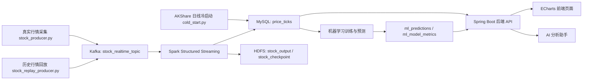
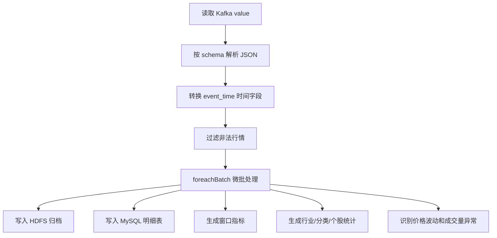

# Quant Stream 股票实时流分析平台项目说明书

## 1. 项目基本信息

| 项目项 | 内容 |
|---|---|
| 项目名称 | Quant Stream 股票实时流分析平台 |
| 项目类型 | 实时数据采集、流式计算、风险预警、机器学习预测、可视化展示综合项目 |
| 主要技术 | Python、Kafka、Spark Structured Streaming、HDFS、MySQL、Spring Boot、ECharts、机器学习 |
| 运行环境 | Windows 本地课程演示环境为主，可迁移到 Linux / 虚拟机大数据环境 |
| 当前项目路径 | `E:\作业\ww\Comprehensive_practice` |
| 前端地址 | `http://127.0.0.1:5500/index.html` |
| 后端地址 | `http://127.0.0.1:8080/api` |

本项目围绕“股票行情实时流分析”展开，目标不是做一个静态股票页面，而是构建一条从数据采集、消息队列、流式计算、数据库落地、机器学习训练、后端接口到前端大屏展示的完整数据工程链路。

项目适合用于课程实践、毕业设计展示和大数据实时处理答辩。它能够体现数据采集、Kafka 消息传输、Spark 实时消费、MySQL 结构化存储、HDFS 归档、前端可视化、风险告警和 AI 辅助解读等多个环节。

## 2. 项目背景与建设目标

股票行情具有实时性强、波动频繁、数据来源复杂、分析维度多等特点。传统静态页面只能展示固定数据，无法体现实时数据流转和动态风险分析。因此本项目希望通过大数据实时流处理技术，对股票行情进行持续采集、实时计算、异常识别和可视化展示。

项目建设目标包括：

- 建立一个可以持续产生股票行情数据的采集端。
- 使用 Kafka 解耦数据生产和数据消费。
- 使用 Spark Structured Streaming 对股票行情进行实时清洗、统计和告警识别。
- 使用 MySQL 保存前端展示所需的明细数据、聚合数据、告警数据和模型预测数据。
- 使用 HDFS 保存流式归档结果和 checkpoint，体现大数据平台的容错与归档能力。
- 使用 Spring Boot 提供统一 API，屏蔽前端直接访问数据库的复杂性。
- 使用 ECharts 构建可视化大屏，展示实时行情、市场概览、风险告警、模型预测和系统状态。
- 使用机器学习模型对短期价格或方向进行辅助预测。
- 使用 AI 助手根据系统数据生成自然语言分析说明，增强项目展示效果。

## 3. 总体架构

项目主链路如下：



从系统职责看，项目可以分为七层：

| 层次 | 主要职责 | 对应目录或文件 |
|---|---|---|
| 数据源层 | 股票池、真实行情接口、历史快照 | `python/data/`、`python/producer/stock_sources.py` |
| 采集生产层 | 采集行情并写入 Kafka | `python/producer/stock_producer.py`、`stock_replay_producer.py` |
| 消息队列层 | 缓冲和转发实时行情流 | Kafka topic `stock_realtime_topic` |
| 流式计算层 | 解析、清洗、聚合、告警、归档 | `python/spark/stock_streaming_job.py` |
| 数据存储层 | 保存明细、统计、告警、模型结果 | MySQL、HDFS |
| 后端服务层 | 查询数据库并提供 REST API | `java-backend/` |
| 展示交互层 | 大屏、子页面、AI 助手 | `frontend/` |

## 4. 目录结构说明

```text
Comprehensive_practice/
├── README.md
├── docs/
│   ├── 股票实时流分析项目说明文档.md
│   ├── 项目功能说明_AI阅读版.md
│   └── 项目说明书_全方位版.md
├── frontend/
│   ├── index.html
│   ├── alerts.html
│   ├── models.html
│   ├── market.html
│   ├── system.html
│   ├── dashboard-home.js
│   ├── shared-ui.js
│   ├── dash-pages.js
│   └── dash-pages.css
├── java-backend/
│   ├── pom.xml
│   └── src/main/java/com/recruitment/backend/
├── python/
│   ├── common/
│   ├── data/
│   ├── ml/
│   ├── producer/
│   ├── spark/
│   ├── sql/
│   └── requirements.txt
└── tools/
    ├── start_demo.ps1
    ├── stop_demo.ps1
    ├── health_check.ps1
    ├── daily_predict.bat
    └── weekly_train.bat
```

各目录职责如下：

| 目录 | 说明 |
|---|---|
| `python/common/` | 公共配置、环境变量读取、股票数据校验、基础工具函数 |
| `python/producer/` | 股票池加载、真实行情采集、历史数据回放、Kafka Producer |
| `python/spark/` | Spark Structured Streaming 实时消费和计算 |
| `python/ml/` | 冷启动数据导入、模型训练、预测、模型漂移检测 |
| `python/sql/` | MySQL 建表脚本 |
| `java-backend/` | Spring Boot 后端服务 |
| `frontend/` | 前端可视化页面 |
| `tools/` | 一键启动、停止、健康检查和定时训练脚本 |
| `docs/` | 项目说明、功能说明和维护文档 |

## 5. 数据采集模块

### 5.1 股票池配置

股票池文件位于：

```text
python/data/stock_symbols.json
```

该文件定义系统需要监控的股票，包括股票代码、公司名称、市场、行业、分类等信息。股票池覆盖 A 股、港股和美股，便于展示不同市场、行业和股票类型的数据分析结果。

### 5.2 真实行情采集

真实行情采集入口：

```text
python/producer/stock_producer.py
```

行情源适配逻辑：

```text
python/producer/stock_sources.py
```

项目支持多个行情来源，例如 Yahoo Finance、东方财富、新浪财经、腾讯证券和 Stooq。不同来源返回的字段格式不同，因此采集端会将原始数据统一转换为标准行情事件。

标准事件主要字段包括：

| 字段 | 含义 |
|---|---|
| `event_id` | 行情事件唯一编号 |
| `symbol` | 股票代码 |
| `company_name` | 公司名称 |
| `category` | 股票分类 |
| `sector` | 行业分类 |
| `market` | 市场，如 SH、SZ、HK、NASDAQ |
| `open_price` | 开盘价 |
| `high_price` | 最高价 |
| `low_price` | 最低价 |
| `last_price` | 最新价 |
| `previous_close` | 昨收价 |
| `change_pct` | 涨跌幅 |
| `volume` | 成交量 |
| `turnover` | 成交额 |
| `event_time` | 行情时间 |
| `source` | 数据来源 |

### 5.3 历史回放采集

历史回放入口：

```text
python/producer/stock_replay_producer.py
```

历史回放主要用于课程演示。因为真实股票市场在休市时价格变化很少，如果只依赖真实行情，前端图表可能长期不动，难以展示实时流效果。历史回放会读取本地历史快照，按固定间隔写入 Kafka，并加入适度波动，让前端可以持续看到数据变化。

推荐演示命令：

```powershell
D:\anaconda3\envs\MachineLearn\python.exe -m python.producer.stock_replay_producer --interval 3 --volatility 1.2
```

## 6. Kafka 消息队列设计

当前项目默认 Kafka topic 为：

```text
stock_realtime_topic
```

Kafka 在系统中的作用：

- 解耦采集端和 Spark 消费端。
- 支持真实采集和历史回放复用同一个流式处理入口。
- 缓冲实时行情，避免采集端和计算端强耦合。
- 体现大数据实时流处理中的消息中间件设计。

生产者写入 Kafka 时，以股票代码作为 key，以行情 JSON 作为 value。这样同一只股票的数据尽量进入同一分区，有利于保持单只股票事件顺序。

需要注意的是，你提供的参考 Kafka 命令使用的是 Linux 路径、Kafka 2.12-2.7.0、topic `weibotop` 和脚本 `weibo_top_consumer.py`。当前项目代码实际使用的是股票项目配置，默认 topic 为 `stock_realtime_topic`，Spark 作业为：

```text
python/spark/stock_streaming_job.py
```

因此如果把 Weibo 项目的命令直接套用到当前股票项目，会出现 topic 不一致、脚本不存在或数据格式不匹配的问题。

## 7. Spark 实时流处理模块

Spark 入口文件：

```text
python/spark/stock_streaming_job.py
```

处理流程如下：



Spark 端主要完成以下任务：

- 从 Kafka 订阅 `stock_realtime_topic`。
- 使用固定 schema 解析 JSON，避免字段格式混乱。
- 过滤价格小于等于 0、成交量小于等于 0、涨跌幅明显异常的数据。
- 使用 `foreachBatch` 对每个微批进行处理。
- 将原始行情写入 `price_ticks`。
- 生成 `metric_snapshots`、`symbol_stats`、`sector_stats`、`category_stats`。
- 根据动态阈值生成 `alert_events`。
- 将原始批次数据以 Parquet 形式归档到 HDFS。
- 使用 checkpoint 保存流处理状态。

当前 Spark 启动命令示例：

```powershell
E:\software\spark-3.5.2-bin-hadoop3\bin\spark-submit.cmd --packages org.apache.spark:spark-sql-kafka-0-10_2.12:3.5.2,mysql:mysql-connector-java:8.0.33 python\spark\stock_streaming_job.py
```

## 8. 异常告警设计

项目当前主要识别两类异常：

| 告警类型 | 含义 |
|---|---|
| `price_volatility` | 价格异常波动 |
| `volume_spike` | 成交量异常放大 |

项目没有只使用固定阈值，而是采用“固定最低阈值 + 历史动态基线”的方式。

价格中危阈值：

```text
price_alert_threshold = max(2.0, avg_abs_change_pct * 2.5)
```

价格高危阈值：

```text
price_high_threshold = max(4.0, avg_abs_change_pct * 4.0)
```

成交量中危阈值：

```text
volume_alert_threshold = max(market_volume_min_threshold, avg_volume * 2.0)
```

成交量高危阈值：

```text
volume_high_threshold = max(market_volume_min_threshold * 2.0, avg_volume * 4.0)
```

这种设计的优点是可以适应不同股票自身的波动特征。大盘股、小盘股、A 股、港股、美股的成交量级别不同，单一固定阈值容易误报或漏报。

## 9. MySQL 数据库设计

建表文件：

```text
python/sql/init.sql
```

核心表如下：

| 表名 | 作用 |
|---|---|
| `price_ticks` | 原始行情明细，是趋势图、告警和训练数据的基础 |
| `metric_snapshots` | 实时窗口指标快照 |
| `symbol_stats` | 个股维度统计 |
| `sector_stats` | 行业维度统计 |
| `category_stats` | 股票池分类统计 |
| `alert_events` | Spark 生成的异常告警 |
| `alert_actions` | 告警处理状态，如已确认、忽略、解决 |
| `ml_predictions` | 当前模型预测结果 |
| `ml_prediction_history` | 预测历史，用于漂移检测 |
| `ml_model_metrics` | 模型验证指标 |

数据库在项目中的作用不是简单保存数据，而是承接 Spark 输出、机器学习输出、后端查询和前端展示，是整个系统的数据中枢。

## 10. HDFS 与归档设计

当前项目 HDFS 配置主要有两个路径：

```text
hdfs://localhost:9000/user/fqy/stock_output
hdfs://localhost:9000/user/fqy/stock_checkpoint
```

作用如下：

| 路径 | 作用 |
|---|---|
| `stock_output` | 保存 Spark 处理后的 Parquet 归档数据 |
| `stock_checkpoint` | 保存 Structured Streaming checkpoint |

HDFS 的意义：

- 展示大数据项目中的分布式存储思想。
- 保存流式处理结果，便于后续离线分析。
- 通过 checkpoint 保证 Spark 流任务具备恢复能力。

当前代码中已经对 HDFS 写入做了容错处理：如果 HDFS 暂时不可用，Spark 会打印 warning 并继续写 MySQL，避免整个展示链路完全中断。

## 11. 机器学习模块

机器学习目录：

```text
python/ml/
```

主要文件：

| 文件 | 作用 |
|---|---|
| `cold_start.py` | 使用 AKShare 导入日线历史数据，解决训练样本不足 |
| `train_predict.py` | 使用实时或分钟级行情训练短期预测模型 |
| `train_daily_predict.py` | 使用日线数据训练更稳定的预测模型 |
| `stock_ml.py` | 特征工程、模型训练、评估、融合、写库核心逻辑 |
| `model_drift.py` | 根据预测历史检测模型漂移 |

当前支持模型：

| 模型 | 说明 |
|---|---|
| Random Forest | 稳定的基础模型，用作 baseline |
| LightGBM | 适合结构化行情特征，训练效率较高 |
| LSTM | 使用连续行情序列学习短期趋势 |
| Ensemble | 融合 LightGBM 和 LSTM 的预测结果 |

模型不是直接预测“稳赚”的投资结论，而是生成课程项目中的辅助分析指标，例如：

- 下一时刻价格预测。
- `UP / DOWN / WATCH` 方向信号。
- 预测置信度。
- 方向准确率、平衡准确率、宏平均 F1、MAE 等指标。

项目保留 `WATCH` 状态是合理的，因为股票短期预测本身噪声很大，当模型没有足够信号时，输出“观望”比强行判断上涨或下跌更符合风险控制场景。

## 12. Spring Boot 后端模块

后端目录：

```text
java-backend/
```

核心文件：

| 文件 | 作用 |
|---|---|
| `RecruitmentBackendApplication.java` | Spring Boot 启动类 |
| `DashboardController.java` | 提供行情、告警、模型、历史数据接口 |
| `AiChatController.java` | 提供 AI 对话和 AI 健康检查接口 |
| `DashboardService.java` | 查询 MySQL 并组装前端所需数据 |
| `AiChatService.java` | 构造 AI 上下文并调用 DeepSeek 兼容接口 |
| `CorsConfig.java` | 处理前后端跨域访问 |
| `application.yml` | 后端端口、数据库、AI、HDFS 配置 |

主要接口：

| 接口 | 说明 |
|---|---|
| `GET /api/dashboard` | 大屏总览数据 |
| `GET /api/health` | 系统健康状态 |
| `GET /api/stocks` | 股票搜索 |
| `GET /api/stocks/{symbol}` | 单只股票详情 |
| `GET /api/stocks/{symbol}/trend` | 股票趋势数据 |
| `GET /api/stocks/ranking` | 优选或风险排行 |
| `GET /api/alerts` | 告警列表 |
| `POST /api/alerts/{id}/status` | 更新告警处理状态 |
| `GET /api/ml/models` | 模型指标 |
| `GET /api/history` | 历史行情 |
| `GET /api/history/export` | 导出 CSV |

后端的核心价值是把复杂 SQL 查询、数据组合、状态判断和 AI 上下文生成统一封装，前端只需要调用 API 即可展示。

## 13. 前端可视化模块

前端目录：

```text
frontend/
```

页面说明：

| 页面 | 作用 |
|---|---|
| `index.html` | 首页预测大屏，展示 KPI、趋势、行业热力、告警、模型信号 |
| `alerts.html` | 风险告警中心，支持告警查看和处理 |
| `models.html` | 模型分析中心，展示模型指标和预测信号 |
| `market.html` | 市场图表中心，展示市场和行业数据 |
| `system.html` | 系统状态中心，展示 MySQL、数据流、数据源、HDFS 状态 |

前端使用原生 HTML、CSS、JavaScript 和 ECharts，优点是部署简单，打开本地静态服务即可运行，适合课程答辩。

前端展示的数据来自 Spring Boot 后端，不直接访问 MySQL。这样可以保证前端逻辑简单，也方便后端统一处理数据格式和异常情况。

## 14. AI 辅助分析模块

项目中 AI 助手不是独立聊天机器人，而是基于系统已有数据进行解释。后端会把 dashboard、告警、模型预测、股票排行等结构化数据整理后放入 AI 上下文，再调用 DeepSeek 兼容接口生成回答。

AI 可以用于：

- 解释当前风险最高的股票。
- 总结市场整体状态。
- 生成某只股票的分析报告。
- 解释模型预测信号。
- 辅助答辩时进行自然语言展示。

如果没有配置 `DEEPSEEK_API_KEY`，系统应尽量返回本地兜底说明，而不是让前端直接崩溃。

## 15. 运行方式

### 15.1 一键启动

推荐演示命令：

```powershell
cd E:\作业\ww\Comprehensive_practice
powershell -ExecutionPolicy Bypass -File .\tools\start_demo.ps1
```

使用真实采集：

```powershell
powershell -ExecutionPolicy Bypass -File .\tools\start_demo.ps1 -UseRealCrawler
```

停止服务：

```powershell
powershell -ExecutionPolicy Bypass -File .\tools\stop_demo.ps1
```

健康检查：

```powershell
powershell -ExecutionPolicy Bypass -File .\tools\health_check.ps1
```

### 15.2 手动启动顺序

1. 初始化 MySQL：

```sql
CREATE DATABASE IF NOT EXISTS stock_stream DEFAULT CHARSET utf8mb4;
USE stock_stream;
SOURCE E:/作业/ww/Comprehensive_practice/python/sql/init.sql;
```

2. 启动 ZooKeeper 和 Kafka。

3. 创建 topic：

```powershell
E:\software\kafka_2.13-3.7.1\bin\windows\kafka-topics.bat --bootstrap-server 127.0.0.1:9092 --create --if-not-exists --topic stock_realtime_topic --partitions 1 --replication-factor 1
```

4. 启动 Spark：

```powershell
E:\software\spark-3.5.2-bin-hadoop3\bin\spark-submit.cmd --packages org.apache.spark:spark-sql-kafka-0-10_2.12:3.5.2,mysql:mysql-connector-java:8.0.33 python\spark\stock_streaming_job.py
```

5. 启动生产者：

```powershell
D:\anaconda3\envs\MachineLearn\python.exe -m python.producer.stock_replay_producer --interval 3 --volatility 1.2
```

6. 启动后端：

```powershell
cd E:\作业\ww\Comprehensive_practice\java-backend
mvn -q -DskipTests package
java -jar target\stock-risk-backend-0.0.1-SNAPSHOT.jar
```

7. 启动前端：

```powershell
cd E:\作业\ww\Comprehensive_practice
D:\anaconda3\envs\MachineLearn\python.exe -m http.server 5500 --directory frontend
```

## 16. 项目亮点

### 16.1 链路完整

项目不是单独的前端页面，也不是单独的 Python 脚本，而是覆盖：

```text
数据采集 -> Kafka -> Spark -> MySQL/HDFS -> Spring Boot -> 前端 -> AI 解读
```

这条链路完整体现了实时数据工程项目的结构。

### 16.2 支持真实采集和历史回放

真实采集适合展示对外部行情源的接入能力；历史回放适合答辩演示，避免休市或网络波动导致大屏没有变化。

### 16.3 告警规则不是前端写死

风险告警由 Spark 根据行情数据、历史基线和阈值动态计算生成，再写入 MySQL，前端只是读取并展示。

### 16.4 模型结果进入业务链路

机器学习模型的预测结果会写入 `ml_predictions` 和 `ml_model_metrics`，再由后端提供给前端展示，而不是训练完只在控制台打印。

### 16.5 系统状态可观测

项目提供健康检查和系统状态页，可以展示数据库、实时流、数据源、HDFS 路径等状态，便于答辩时说明系统是否真正运行。

## 17. 开发过程中遇到的困难

### 17.1 多数据源字段不统一

不同股票网站返回的数据格式、字段名、市场代码、价格单位都不一致。例如 A 股、港股、美股的数据来源和代码格式不同，直接写入 Kafka 会导致 Spark schema 解析失败或前端字段缺失。

解决方式：

- 在 `stock_sources.py` 中统一做字段标准化。
- 对价格、成交量、涨跌幅进行类型转换。
- 对市场、行业、分类等元数据进行补充。
- 某个数据源失败时自动 fallback 到其他数据源。

### 17.2 真实行情受休市和接口限制影响

股票市场休市时，真实价格变化少，前端趋势图可能接近直线。免费行情源还可能存在访问频率限制、网络延迟、接口变更等问题。

解决方式：

- 增加历史回放模式。
- 演示时优先使用 `stock_replay_producer.py`。
- 真实采集作为项目能力展示，不强行依赖它完成每次答辩演示。

### 17.3 Kafka、Spark、HDFS 在 Windows 上联动复杂

项目在 Windows 本地运行，需要同时启动 ZooKeeper、Kafka、Spark、HDFS、MySQL、后端和前端。各组件依赖端口、路径、环境变量和临时目录，容易出现某个组件没启动或启动慢导致后续组件失败。

遇到过的问题包括：

- ZooKeeper 数据目录访问异常。
- Kafka 端口监听了但 broker API 尚未完全 ready。
- Producer 报 `NoBrokersAvailable`。
- Spark Ivy 缓存或临时 jar 文件访问失败。
- Spark 关闭时临时目录中的 jar 被占用，删除失败。
- HDFS 不可用时影响 Spark 写归档。

解决方式：

- `tools/start_demo.ps1` 增加了运行时目录 `E:\stockrt`。
- 为 Kafka、Spark、Ivy、临时目录设置独立路径。
- 增加 `Wait-KafkaReady()`，等待 Kafka 真正可用后再提交 Spark。
- HDFS 写入失败时不直接终止 MySQL 写入，保证前端展示主链路尽量可用。

### 17.4 Spark 实时告警需要兼顾误报和漏报

如果只用固定阈值，不同市场和不同股票之间差异太大。成交量大的股票很容易误报，成交量小的股票又可能漏报。

解决方式：

- 读取最近一天历史数据作为动态基线。
- 价格告警使用历史平均绝对涨跌幅倍数。
- 成交量告警按市场设置不同固定下限。
- 高危和中危告警使用不同倍数阈值。

### 17.5 机器学习样本质量不足

短期股票预测噪声大，实时采集数据如果时间跨度短、重复价格多，模型很难学到有效规律。尤其在休市或使用重复快照时，训练集可能大量集中在 `WATCH` 或某一类。

解决方式：

- 增加 AKShare 冷启动日线数据导入。
- 使用 `train_daily_predict.py` 作为更稳定的答辩训练入口。
- 保留 `UP / DOWN / WATCH` 三分类，不为了提高表面准确率强行删除观望类。
- 前端展示平衡准确率、宏平均 F1、多数类基线等更合理指标。

### 17.6 前后端数据口径需要统一

前端需要展示实时状态、告警数量、模型信号、行业热力、系统健康等多种指标。如果每个页面自己拼接数据，容易出现字段不一致或状态判断不统一。

解决方式：

- 后端提供 `/api/dashboard` 聚合接口。
- 后端统一判断 `FLOWING / DELAYED / STOPPED`。
- 前端页面统一使用后端 JSON 字段渲染。

## 18. 当前项目的困境

### 18.1 当前命令说明与项目实际代码存在不一致

你提供的 Kafka 命令是 Weibo 项目的命令，使用：

```text
topic: weibotop
脚本: weibo_top_consumer.py
Kafka: /opt/software/kafka_2.12-2.7.0
Spark 包: spark-streaming-kafka-0-10_2.12:3.0.1
HDFS 路径: /user/fqy/weibo_sentiment_output
```

但当前项目实际是股票实时流项目，使用：

```text
topic: stock_realtime_topic
脚本: python/spark/stock_streaming_job.py
Kafka: Windows 本地 kafka_2.13-3.7.1
Spark 包: spark-sql-kafka-0-10_2.12:3.5.2
HDFS 路径: /user/fqy/stock_output 和 /user/fqy/stock_checkpoint
```

这是当前最明显的文档困境：如果按 Weibo 命令运行当前项目，会和代码实际 topic、数据格式、脚本入口不匹配。后续需要把老师要求、虚拟机命令和当前股票项目命令统一成一份最终版运行手册。

### 18.2 实时链路仍然不够稳定

当前项目代码已经具备完整链路，但 Windows 本地多组件联动仍然容易受环境影响。尤其是 Kafka、Spark、HDFS 同时启动时，任何一个组件启动慢、端口被占用、临时目录无权限，都可能导致实时流没有正常进入 MySQL。

当前表现：

- 后端和前端相对容易启动。
- MySQL 查询和静态页面展示较稳定。
- Kafka/Spark/HDFS 链路对本机环境依赖较强。
- 演示时推荐使用 `tools/start_demo.ps1`，并通过 `health_check.ps1` 判断状态。

### 18.3 HDFS 在本地演示中不是绝对稳定依赖

HDFS 对大数据项目很重要，但在本地 Windows 环境中配置成本较高。当前代码已经允许 HDFS 写入失败时继续写 MySQL，这保证了大屏展示，但也意味着 HDFS 归档能力可能不是每次都能稳定展示。

当前困境是：

- 如果强调大数据完整性，需要确保 HDFS 真正可用。
- 如果强调答辩展示稳定性，则需要允许 HDFS 暂时失败但 MySQL 和前端继续运行。

### 18.4 模型预测效果受数据质量限制

股票短期预测本身难度高，当前项目训练数据主要来自短期实时流、历史回放和 AKShare 日线冷启动。数据量、时间跨度和市场环境还不足以支撑真实投资级预测。

因此模型结果更适合作为课程项目中的“辅助分析”和“机器学习链路展示”，不能作为真实投资建议。

当前需要说明：

- 模型指标只代表当前数据集上的验证结果。
- `WATCH` 比例高不一定是错误，可能说明市场或样本中无明显方向。
- 数据质量比盲目调参更重要。

### 18.5 配置仍偏本地演示

当前后端配置中数据库账号、HDFS 路径、AI 接口等都偏本地环境。对于课程演示可以接受，但如果迁移到服务器或局域网部署，需要进一步改造。

需要优化的点：

- `.env` 和敏感配置不应提交或公开。
- MySQL 不应长期使用 `root/root`。
- CORS 应限制到真实前端地址。
- 告警处理接口应增加认证。
- Kafka、Spark、HDFS 路径应统一通过配置管理。

### 18.6 项目规模较大，答辩讲解容易发散

项目包含采集、Kafka、Spark、HDFS、MySQL、后端、前端、AI、机器学习多个模块。如果答辩时逐个细节展开，容易讲散。

建议答辩主线固定为：

```text
为什么做 -> 数据怎么来 -> Kafka 如何传 -> Spark 怎么算 -> MySQL/HDFS 怎么存 -> 前端怎么展示 -> 模型和 AI 如何增强 -> 当前限制
```

## 19. 后续改进方向

### 19.1 统一运行文档

把当前项目的 Windows 运行命令、Linux 虚拟机运行命令、Kafka topic、HDFS 路径和 Spark 提交命令整理成一份最终版，不再混用 Weibo 项目命令。

### 19.2 提升实时链路稳定性

- 增加更详细的启动前环境检查。
- 自动检测端口占用并给出明确提示。
- 对 Kafka、Spark、HDFS 日志做统一摘要。
- 增加一键清理运行时临时目录的安全脚本。

### 19.3 增强 HDFS 展示能力

- 前端系统状态页增加 HDFS 文件数量、最近写入时间。
- 后端增加 HDFS 命令检查或 WebHDFS 检查。
- Spark 写入 HDFS 后记录归档批次信息。

### 19.4 增强机器学习可信度

- 增加更多历史行情数据。
- 区分分钟级模型和日线级模型。
- 增加模型解释，例如特征重要性。
- 增加回测指标，而不仅是单次验证集指标。
- 增加数据质量报告，说明样本分布、类别比例和重复率。

### 19.5 增强告警规则

当前告警主要是价格波动和成交量异常，后续可以增加：

- RSI 超买超卖。
- MACD 金叉死叉。
- 均线偏离。
- 连续上涨或连续下跌。
- 行业联动异常。
- 模型预测与真实走势偏离告警。

### 19.6 增强部署规范

- 使用统一配置文件管理 MySQL、Kafka、HDFS、AI Key。
- 增加 Docker Compose 或虚拟机部署说明。
- 增加生产环境安全说明。
- 增加日志轮转和异常恢复策略。

## 20. 答辩讲解建议

答辩时可以按下面顺序讲：

1. 先说明项目定位：股票实时流分析平台，不是静态展示页面。
2. 展示总体架构图，说明数据从采集端进入 Kafka，再由 Spark 处理。
3. 打开前端首页，说明实时行情、趋势、行业热力和模型信号。
4. 打开告警页面，说明告警由 Spark 根据阈值计算产生。
5. 打开模型页面，说明 Random Forest、LightGBM、LSTM 的作用和指标。
6. 打开系统状态页，说明 MySQL、实时流、数据源和 HDFS 状态。
7. 演示 AI 助手，让 AI 根据当前系统数据解释某只股票或当前风险。
8. 最后主动说明当前困境：本地多组件启动复杂、HDFS 依赖环境、模型受数据质量限制、命令文档需要统一。

可以重点强调：

- 项目链路完整。
- 数据不是写死的，支持采集和回放。
- 告警不是前端模拟，而是 Spark 计算结果。
- 模型结果落库并被前端消费。
- 系统状态可观测，便于排查问题。
- 当前限制已经识别，并有明确改进方向。

## 21. 总结

Quant Stream 股票实时流分析平台是一个覆盖实时数据工程全链路的综合项目。它从股票行情采集开始，通过 Kafka 传输实时数据，由 Spark Structured Streaming 完成清洗、统计、告警和归档，再将结果写入 MySQL 与 HDFS，最终由 Spring Boot 后端和 ECharts 前端完成可视化展示，并结合机器学习和 AI 助手提供辅助分析能力。

项目当前已经具备课程答辩所需的主体功能和展示价值，但仍存在运行环境复杂、实时链路稳定性不足、HDFS 本地依赖较强、机器学习样本质量有限、运行命令文档不统一等问题。后续工作的重点应放在统一运行手册、提升启动稳定性、增强数据质量、完善 HDFS 可观测性和提高模型解释能力上。

整体来看，本项目的价值不在于单个模型预测有多准确，而在于把大数据实时处理、风险预警、机器学习、后端服务和前端可视化整合成了一条完整、可演示、可继续扩展的工程链路。
